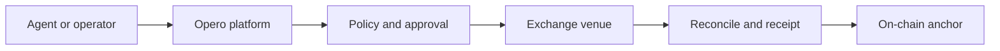

  

  Automated execution, engineered for control.

Opero AI runs trading strategies on perpetual futures venues on behalf of the
account holder. Strategies quote and trade within limits set before capital is
committed: the markets they may touch, the size they may take, and the exposure
they may carry. Every order passes schema validation, policy limits and an
intent-bound approval, and is reconciled against the venue before it counts as
done. Each run emits a signed receipt, including the evaluations it declines.

Accounts are opened and funded from the account holder's own wallet. Signing
authority granted to Opero AI is bounded by a wallet policy enforced at the
custody provider, is visible in the account at all times, and can be withdrawn
by the account holder without contacting support.

## Projects

| Project | Purpose |
| --- | --- |
| [`opero-protocol`](https://github.com/projectopero/opero-protocol) | Signed order intents, shared wire types and the public receipt specification |
| [`opero-contracts`](https://github.com/projectopero/opero-contracts) | On-chain receipt anchoring and settlement contracts |

The trading runtime, strategy marketplace and decision engine are maintained as
proprietary components.

## Availability

Account registration is open. Live trading and simulated trading run side by
side: a simulated strategy evaluates live market data and commits no capital,
and both may run in the same account at once. Simulated results are labelled as
such wherever they appear and are never combined with realised performance.

Automated trading carries risk of loss. Past or simulated performance does not
indicate future results. Nothing here is investment advice, and strategies act
only within their configured limits.

## Participate

- Read the [protocol specification](https://github.com/projectopero/opero-protocol).
- Review the [contracts](https://github.com/projectopero/opero-contracts).
- Open focused issues and proposals in the relevant repository.
- Report vulnerabilities through the affected repository's private
  vulnerability-reporting channel.

Website: [projectopero.com](https://projectopero.com)
